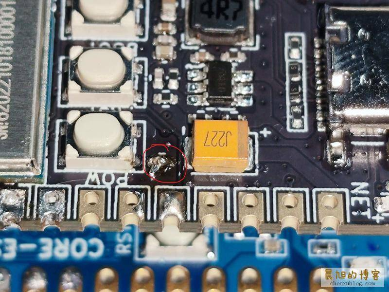
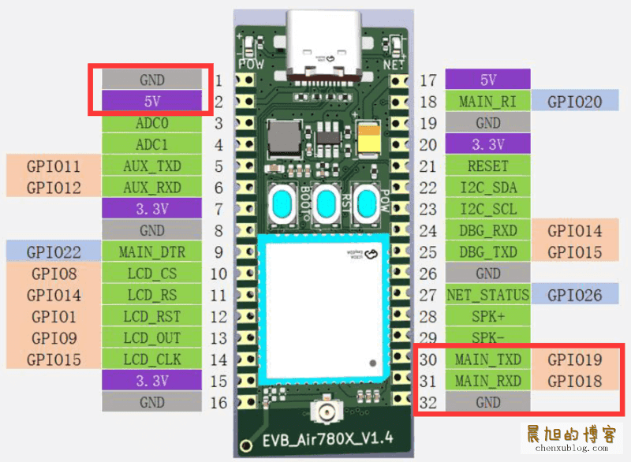
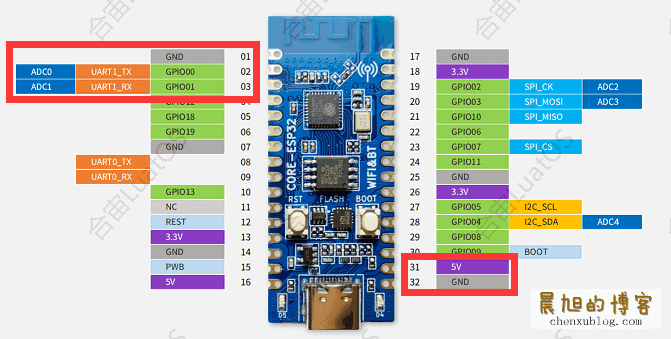
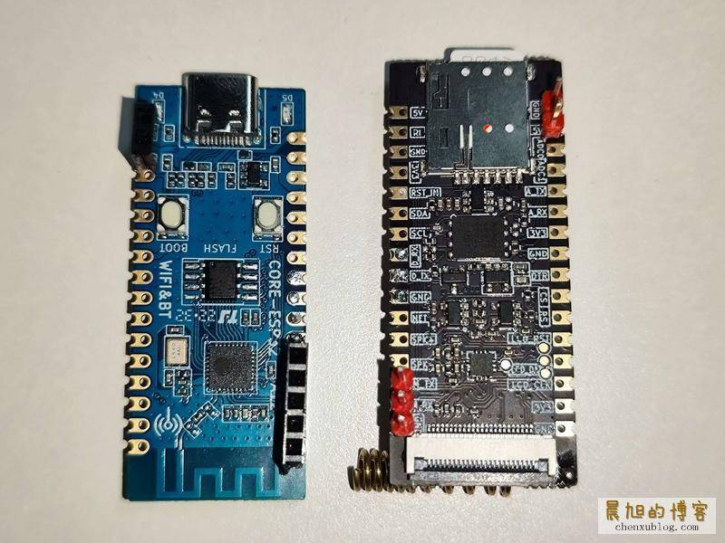
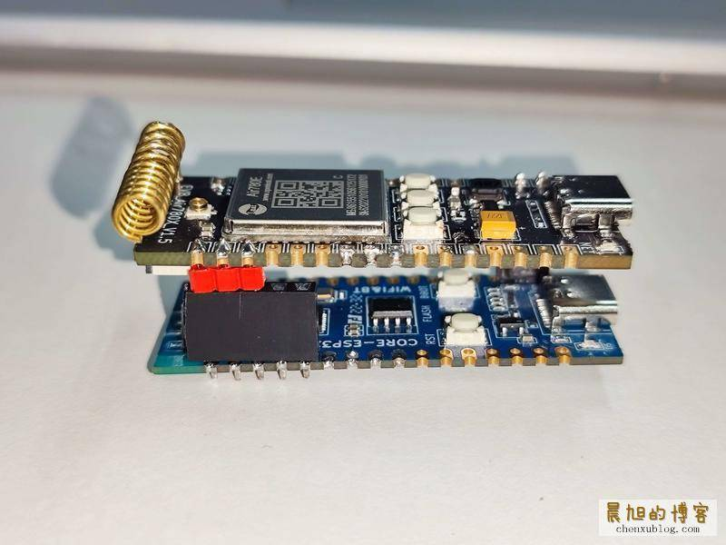
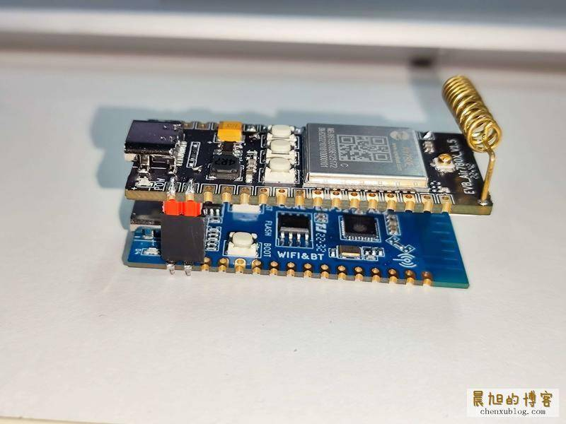
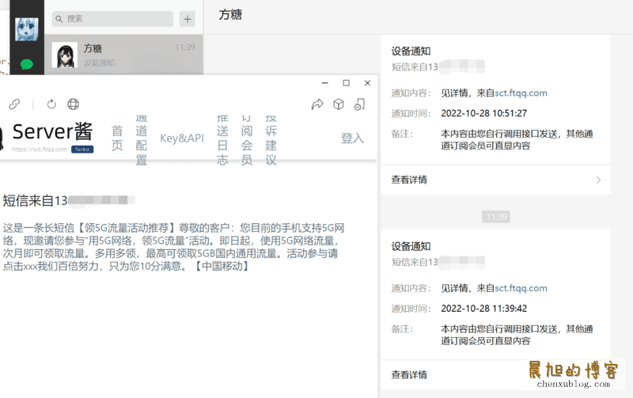

# 50元内自制短信转发器（Air780E+ESP32C3） – 晨旭的博客（节选）

---

## 准备材料

-   合宙`ESP32-C3开发板`简约款（合宙淘宝/拼多多官方店9.9元包邮的简约款即可，不用买经典款）
-   合宙`Air780E开发板`（购买途径同上）
-   焊接工具与必要的排针、排母（上面板子应该附赠排针的）
-   用来接收短信用的卡
-   2.4G Hz的wifi，用来联网
-   对接的服务器有几个选择
    -   [LuatOS社区提供的推送服务器](https://push.luatos.org/)（点击GitHub图标即可登录，然后点击左边的`消息通道`新建一个推送方式）
    -   [server酱](https://sct.ftqq.com/)（免费用户每天只能发送五条）
    -   你也可以对接自己的推送服务器，但是代码要自己稍微改改

## 硬件对接

由于Air780E需要按下开机键才能开机，而我们需要上电即开机，所以可以**短接**此处的焊盘，实现Air780E开发板上电即开机的功能：

接着，我们需要将`Air780E开发板`与`ESP32-C3开发板`的`电源引脚`相连（5V与GND）、将`ESP32-C3开发板`的`UART1`与`Air780E开发板`的`MAIN_UART`相连，引脚如下（两组的实际位置是相同的）：

分别将两块板子焊接上排针与排母，像这样（能一对一插上就行）：

接着别忘了再给Air780开发板上插上SIM卡

全搞定后，直接对齐插上去就行了：

## 刷入固件与脚本

接下来需要为esp32c3刷入写好的固件与脚本

如果不会烧录，请先看一下[esp32c3烧录教程](https://www.bilibili.com/video/BV1Mq4y1e7Eb?p=3)

这里我们需要使用新版的`V10xx`固件，可以直接去[下载快照版固件](https://nightly.link/openLuat/LuatOS/workflows/esp32c3-idf5/master/esp32c3.zip)

脚本可以在这个仓库下载：[chenxuuu/sms\_forwarding – GitHub](https://github.com/chenxuuu/sms_forwarding)

我们需要修改脚本中的`notify.lua`，按注释要求改为自己的逻辑：

如果需要用自己的推送服务，还可以把下面的http请求改成自己服务器支持的格式

## 测试功能

烧录脚本和固件后，可以看到设备的日志，正常连上wifi与连上了基站

接下来我们发一条短信试试，脚本内部对长短信进行了处理，所以长短信也可以完美支持。可以看到设备端的日志：

同时我们收到了推送来的消息：

如果是server酱，那么是这样的：

